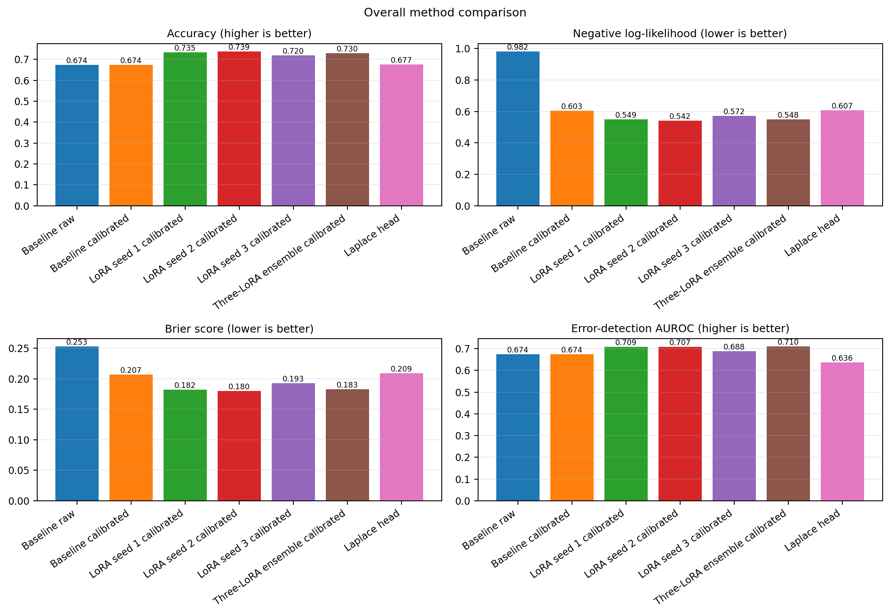
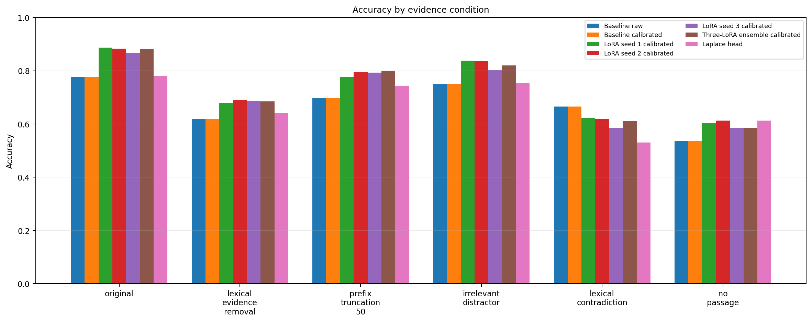
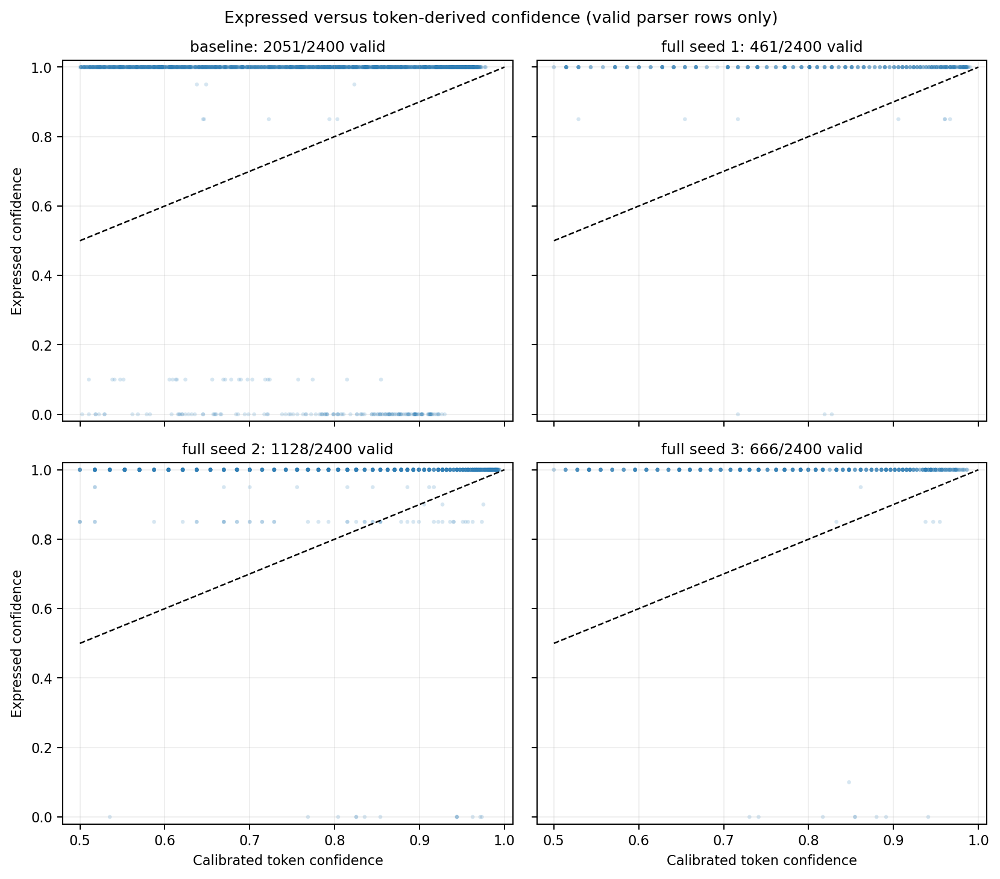
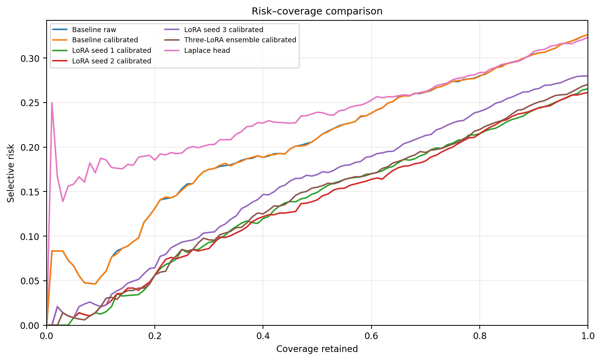

# Confidence Alignment and Uncertainty Quantification in LLMs Under Evidence Degradation

**Technical report — version 0.1.0 (2026-08-04)**

## Abstract

This study evaluates whether confidence estimates from a compact
instruction-tuned language model respond appropriately when evidence is
removed, truncated, distracted, contradicted, or withheld. A frozen
Qwen2.5-1.5B-Instruct baseline was compared with three independently seeded
LoRA adapters, temperature-scaled probabilities, a three-adapter ensemble,
and a Laplace-approximated Bayesian binary linear head over frozen model
representations. Experiments used deterministic 800/200/400 BoolQ
train/calibration/test subsets and 2,400 condition-level test rows. The best
single adapter achieved 73.88% overall accuracy versus
67.38% for the calibrated baseline. The ensemble gave
the strongest observed error-detection AUROC (0.7102),
whereas the Laplace head gave the lowest aggregate 10-bin ECE
(0.0230) without leading on accuracy or error ranking.
Evidence removal generally reduced confidence and raised entropy, but the
response depended on the method and perturbation. Generated numerical
confidence was frequently malformed after LoRA adaptation, limiting direct
expressed-versus-statistical confidence comparisons. Results are descriptive
for one model, one bounded dataset sample, and predefined perturbations.

## 1. Research question

How do expressed confidence, token-derived statistical confidence,
calibrated confidence, ensemble uncertainty, and approximate Bayesian-head
uncertainty behave when an LLM receives incomplete, distracting,
contradictory, or absent supporting evidence?

## 2. Connection to Evidence-State Reliability

The project extends the separate Evidence-State Reliability study from
pipeline-level evidence handling to model-level confidence. The earlier
work motivated a narrower question: a system may become easier to parse
without becoming more epistemically reliable. Here, generated confidence
format validity and probability-based uncertainty are measured separately,
so syntactic compliance cannot substitute for uncertainty quality.

## 3. Dataset and evidence conditions

The source dataset is `google/boolq` at revision
`35b264d03638db9f4ce671b711558bf7ff0f80d5`. Deterministic
SHA-256-stratified selection with seed 20260803 produced
800 training, 200
calibration, and 400 test inputs. The official
BoolQ training split supplies the disjoint training and calibration subsets;
the official validation split supplies the test subset. Raw passages are not
committed.

Six categorical conditions were fixed before evaluation:

1. Original evidence.
2. Removal of the sentence span with greatest unique-token Jaccard overlap
   with the question.
3. Retention of the first half of passage tokens, rounded upward.
4. Insertion of a fragment from another selected input with minimum lexical
   overlap under a deterministic hash tie-break.
5. Insertion of a templated negation of a high-overlap sentence fragment.
6. The question without a passage.

All 400 inputs were transformed successfully under all conditions. These
conditions are not an ordered degradation scale. Lexical evidence removal
is a proxy, minimum lexical overlap does not prove semantic irrelevance, and
the templated statement is not guaranteed to contradict the labelled answer.

## 4. Model and fine-tuning method

The base model is `Qwen/Qwen2.5-1.5B-Instruct` at revision
`989aa7980e4cf806f80c7fef2b1adb7bc71aa306`. Contextual continuations
` Yes` and ` No` were verified as single tokens with IDs 7414 and 2308.

LoRA adapters were attached to `q_proj`, `k_proj`, `v_proj`, `o_proj`,
`gate_proj`, `up_proj`, and `down_proj` in each transformer layer. Rank was
8, alpha 16, and dropout
0.05. The adapters contained
9,232,384 trainable parameters
(0.595%
of 1,552,946,688 total
parameters). Training used an explicit PyTorch loop, answer-token
cross-entropy, AdamW, gradient accumulation to an effective batch size of
32, gradient clipping at
1.0, learning rate
0.0002, and three epochs. No numerical
confidence target was used.

| Adapter | Seed | Epoch mean losses | Training time | Peak allocated GPU memory |
|---|---:|---|---:|---:|
| LoRA seed 1 | 20260811 | 0.4670, 0.2242, 0.0993 | 210.8 s | 15.84 GiB |
| LoRA seed 2 | 20260812 | 0.4942, 0.2705, 0.1316 | 210.5 s | 15.87 GiB |
| LoRA seed 3 | 20260813 | 0.4665, 0.2206, 0.0892 | 212.3 s | 15.85 GiB |

All losses remained finite, all trainable parameters received gradients,
parameters changed, and each saved adapter reproduced validation logits
after reload. Declining training loss is an optimization diagnostic, not a
generalization claim.

## 5. Confidence definitions

- **Expressed confidence:** the parsed integer from the generated
  `Confidence: N` line, retained only when format validation succeeds.
- **Token-derived confidence:** the two-class softmax probability of the
  selected contextual Yes/No answer token.
- **Calibrated confidence:** token probability after division of logits by
  a positive temperature fitted on calibration data.
- **Predictive entropy:** binary entropy of the predictive mean.
- **Ensemble uncertainty:** variation and entropy decomposition across three
  independently seeded LoRA members.
- **Bayesian-head uncertainty:** posterior predictive variation from sampled
  weights of a diagonal Laplace approximation to a binary linear head.

Generated confidence is not treated as a statistical probability, and
malformed values are not assigned a fallback.

## 6. Calibration method

One positive scalar temperature per baseline/adapter method was fitted by
minimizing calibration-split negative log-likelihood on original evidence.
Class ordering remained `[Yes, No]`; test labels were unavailable during
fitting; and temperature scaling did not alter predicted classes.

| Method | Temperature | Calibration NLL before | Calibration NLL after |
|---|---:|---:|---:|
| Baseline | 2.9551 | 0.6742 | 0.4362 |
| LoRA seed 1 | 2.1542 | 0.4409 | 0.3403 |
| LoRA seed 2 | 1.7702 | 0.3952 | 0.3414 |
| LoRA seed 3 | 2.2581 | 0.4891 | 0.3673 |

Calibration-split improvement does not guarantee improvement for every test
condition. ECE is bin-dependent and can appear favourable for an inaccurate
or underconfident model.

## 7. Ensemble method

The ensemble averages binary probabilities from LoRA adapters trained with
seeds 20260811, 20260812, and 20260813. Member weights, initializations, and
prediction files were verified to differ. Predictive entropy, expected
member entropy, population probability variance, vote disagreement, and the
finite-ensemble entropy Jensen gap were recorded. The members are not
posterior samples, so the Jensen gap is described as mutual-information-style
rather than exact Bayesian mutual information.

## 8. Bayesian prediction-head method

The transformer was frozen and supplied 1,536-dimensional final hidden
states at the last attended answer-prefix token. A binary logistic linear
head was fitted by MAP estimation with a zero-mean isotropic Gaussian prior
of precision 1.0. The diagonal of the exact logistic negative-log-posterior
curvature was inverted to form a local diagonal Gaussian approximation.
The full evaluation used 256 sampled head-weight vectors to estimate
posterior predictive means, variances, expected entropy, and mutual
information.

This is a **Laplace-approximated Bayesian prediction head over frozen LLM
representations**. It does not make the transformer Bayesian. The diagonal
approximation ignores parameter correlations and is local to the MAP mode.

## 9. Experimental protocol

Labels were unavailable to baseline, adapter, ensemble, and Laplace test
inference. Calibration used only 200 calibration labels under original
evidence. Test labels were joined only after predictions were frozen. Each
method was evaluated on the same 400 inputs under six conditions. Source
coordinates, transformations, predictions, metrics, configurations,
checkpoints, and figures are bound by SHA-256 ledgers. Failed runs remain in
the manifest history.

## 10. Metrics

- **Accuracy** measures discrete answer correctness but ignores confidence.
- **Negative log-likelihood (NLL)** scores the probability assigned to the
  observed class and strongly penalizes confident errors.
- **Brier score** is squared error of the Yes probability; it combines
  calibration and discrimination.
- **10-bin ECE** compares mean confidence and empirical accuracy within
  fixed bins; it is sensitive to binning and sample size.
- **Predictive entropy** measures uncertainty of a binary predictive mean.
- **Error-detection AUROC** measures whether `1-confidence` ranks errors
  above correct predictions; it does not select an operating threshold.
- **Risk–coverage** orders examples by confidence and reports selective risk
  as lower-confidence predictions are withheld.
- **Paired confidence/entropy change** compares each degraded input with its
  original counterpart.
- **Expressed/token divergence** is absolute difference on parser-valid rows
  only; coverage must be reported beside it.

## 11. Results

### 11.1 Overall comparison

| Method | Accuracy | NLL ↓ | Brier ↓ | ECE (10 bins) ↓ | Error AUROC ↑ |
|---|---:|---:|---:|---:|---:|
| Baseline raw | 67.38% | 0.9824 | 0.2530 | 0.2138 | 0.6735 |
| Baseline calibrated | 67.38% | 0.6035 | 0.2072 | 0.0686 | 0.6735 |
| LoRA seed 1 calibrated | 73.46% | 0.5492 | 0.1821 | 0.0771 | 0.7088 |
| LoRA seed 2 calibrated | 73.88% | 0.5422 | 0.1800 | 0.0756 | 0.7073 |
| LoRA seed 3 calibrated | 72.00% | 0.5723 | 0.1927 | 0.0866 | 0.6879 |
| Three-LoRA ensemble calibrated | 72.96% | 0.5482 | 0.1829 | 0.0723 | 0.7102 |
| Laplace head | 67.67% | 0.6067 | 0.2088 | 0.0230 | 0.6356 |

LoRA seed 2 had the highest overall accuracy (73.88%) and
lowest overall NLL (0.5422) and Brier score
(0.1800) among the primary variants. The calibrated ensemble
had slightly lower accuracy (72.96%) but the strongest
error-detection AUROC (0.7102). The
Laplace head's low ECE (0.0230) coexisted with
67.67% accuracy and AUROC
0.6356; this illustrates why calibration
error cannot be interpreted alone.

### 11.2 Evidence-condition accuracy

| Evidence condition | Baseline calibrated | LoRA seed 2 calibrated | Calibrated ensemble | Laplace head |
|---|---:|---:|---:|---:|
| Original | 77.75% | 88.25% | 88.00% | 78.00% |
| Lexical evidence removal | 61.75% | 69.00% | 68.50% | 64.25% |
| Prefix truncation (50%) | 69.75% | 79.50% | 79.75% | 74.25% |
| Irrelevant distractor | 75.00% | 83.50% | 82.00% | 75.25% |
| Lexical contradiction | 66.50% | 61.75% | 61.00% | 53.00% |
| No passage | 53.50% | 61.25% | 58.50% | 61.25% |

Original-evidence accuracy was highest for the calibrated three-LoRA
ensemble (88.00%).
For that ensemble, removing all passage evidence reduced accuracy to
58.50%,
mean confidence by -0.121,
and increased predictive entropy by
+0.180 nats.
Lexical contradiction was also damaging, but results do not define a
monotonic perturbation severity order.

### 11.3 Expressed-confidence alignment

| Method | Parser-valid rows | Valid rate | Mean expressed confidence (valid only) | Mean calibrated absolute divergence (valid only) |
|---|---:|---:|---:|---:|
| Baseline | 2051/2400 | 85.46% | 91.45% | 0.2912 |
| LoRA seed 1 | 461/2400 | 19.21% | 99.12% | 0.1802 |
| LoRA seed 2 | 1128/2400 | 47.00% | 98.14% | 0.1959 |
| LoRA seed 3 | 666/2400 | 27.75% | 98.57% | 0.2105 |

The adapters often produced the correct answer token while failing the
required two-line generated format. Consequently, divergence means for
adapters describe a selected parser-valid subset and must not be generalized
to all rows. The absence of imputation is deliberate.

### 11.4 Selective prediction and uncertainty shifts

The saved risk–coverage table contains one deterministic ordering for every
primary variant, with ties broken by analysis ID. Confidence and entropy
heatmaps show that the no-passage condition generally produces the largest
confidence reductions and entropy increases for token-derived methods. The
Laplace head changes less across some perturbations, which should not be read
as automatically better shift detection because its aggregate error AUROC
is lower.

## 12. Failure analysis

The strongest operational failure was generated-format instability after
answer-token-only LoRA training. This is consistent with the training
objective: it directly supervises only the answer token and does not train
the numerical confidence line. The lexical-removal procedure removed the
whole passage for 34 inputs, while three selected spans had zero lexical
overlap. Distractor fragments were shorter than requested for 205 inputs;
contradiction fragments were shorter for 386. These flags are retained in
the transformation metadata instead of being hidden.

## 13. Limitations

1. Results use one 1.5B-parameter model and a bounded 400-input test subset.
2. No confidence intervals or hypothesis tests were computed; comparisons
   are descriptive and may reflect finite-sample variation.
3. The perturbations use lexical proxies and do not establish semantic
   irrelevance, answer contradiction, or ordered severity.
4. Only three LoRA members were trained; ensemble estimates are coarse and
   are not Bayesian posterior quantities.
5. The Laplace approximation covers only a linear head, uses diagonal
   curvature, and depends on frozen representation quality.
6. ECE depends on ten fixed bins and can obscure within-bin behaviour.
7. Expressed-confidence analysis has severe method-dependent missingness.
8. Deterministic settings improve within-environment reproducibility but do
   not guarantee bitwise identity across hardware or library versions.
9. Test results were inspected only after protocols were frozen; they are
   not a basis for retrospective method selection or tuning.

## 14. Reproducibility statement

The repository records exact model and dataset revisions, source hashes,
split IDs, configurations, package versions, seeds, hardware, checkpoint
hashes, prediction hashes, success/failure manifests, derived tables, and
figure-source mappings. The full runs used Python 3.12.13, PyTorch
2.11.0+cu128, Transformers 5.13.1, PEFT 0.19.1, and an NVIDIA
A100-SXM4-80GB. Raw passages and model weights are excluded. Historical run
manifests have `git_head: null` because experiments preceded the first
repository commit; immutable input/output hashes provide the execution
lineage, while the release commit identifies the published code snapshot.
See `report/reproducibility.md`.

## 15. Claim boundaries

Supported claims include deterministic data preparation, explicit PyTorch
LoRA training, probability extraction, calibration-only temperature fitting,
three-member ensemble analysis, and a diagonal Laplace approximation for a
binary linear head. Unsupported claims include full-model training, a fully
Bayesian transformer, posterior-sample interpretation of LoRA members,
semantic guarantees for lexical perturbations, statistical significance,
state-of-the-art performance, and peer review.

## 16. Future work

Future work should repeat the protocol across model families and larger
samples, introduce semantically validated perturbations, supervise or
separately model expressed confidence, quantify uncertainty with repeated
dataset resampling, compare richer covariance approximations, and predefine
formal statistical tests before collecting new test results.

## 17. References

1. Clark et al. (2019), *BoolQ: Exploring the Surprising Difficulty of
   Natural Yes/No Questions*, NAACL.
2. Hu et al. (2022), *LoRA: Low-Rank Adaptation of Large Language Models*,
   ICLR.
3. Guo et al. (2017), *On Calibration of Modern Neural Networks*, ICML.
4. Lakshminarayanan, Pritzel, and Blundell (2017), *Simple and Scalable
   Predictive Uncertainty Estimation using Deep Ensembles*, NeurIPS.
5. Daxberger et al. (2021), *Laplace Redux—Effortless Bayesian Deep
   Learning*, NeurIPS.
6. Qwen Team, `Qwen/Qwen2.5-1.5B-Instruct` model card, pinned revision used
   in this repository.
